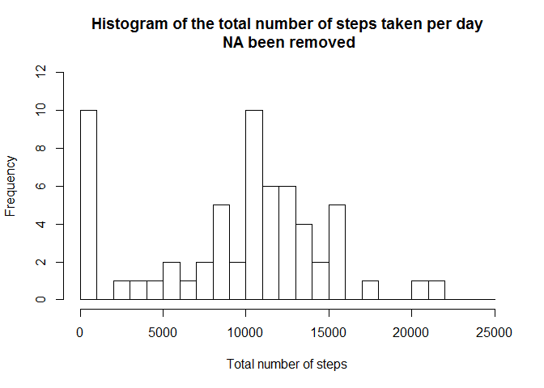
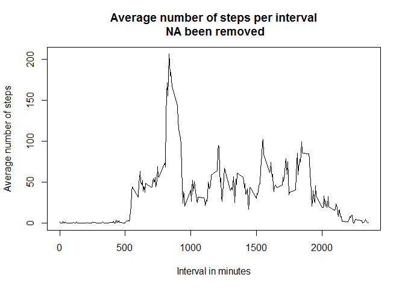
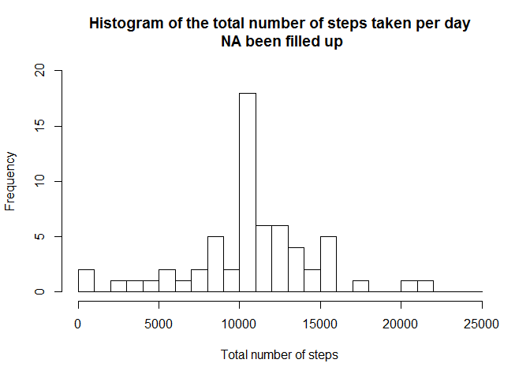
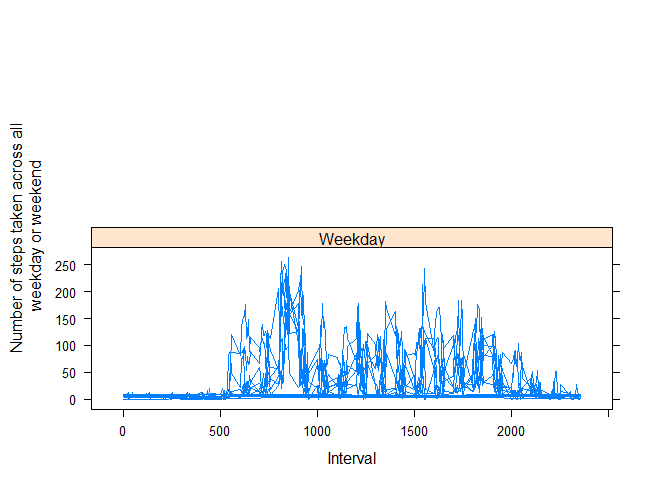

# Assignment Course Project 1
Richard Yin  
2016年2月19日  


```r
plot(cars)
```


## loading lattice library

```r
library(lattice)

## loading dataset from local drive
```

```r
MonitoringData <- read.csv("activity.csv")
```

## checking the dimension and first few row of dataset

```r
dim(MonitoringData)
```

```
## [1] 17568     3
```
# [1] 17568     3


```r
head(MonitoringData)
```

```
##   steps       date interval
## 1    NA 2012-10-01        0
## 2    NA 2012-10-01        5
## 3    NA 2012-10-01       10
## 4    NA 2012-10-01       15
## 5    NA 2012-10-01       20
## 6    NA 2012-10-01       25
```
# steps       date interval
# 1    NA 2012-10-01        0
# 2    NA 2012-10-01        5
# 3    NA 2012-10-01       10
# 4    NA 2012-10-01       15
# 5    NA 2012-10-01       20
# 6    NA 2012-10-01       25

## calculate the total number of steps taken per day 

```r
SummaryStepsDataByDate <- aggregate(MonitoringData$steps, 
                                    by = list(MonitoringData$date), 
                                    FUN = sum, 
                                    na.rm = TRUE)
```

## rename the column in Summary dataset

```r
names(SummaryStepsDataByDate) <- c("date", "total")
```

## display the first few row of total number of steps taken per day

```r
head(SummaryStepsDataByDate)
```

```
##         date total
## 1 2012-10-01     0
## 2 2012-10-02   126
## 3 2012-10-03 11352
## 4 2012-10-04 12116
## 5 2012-10-05 13294
## 6 2012-10-06 15420
```
# date total
# 1 2012-10-01     0
# 2 2012-10-02   126
# 3 2012-10-03 11352
# 4 2012-10-04 12116
# 5 2012-10-05 13294
# 6 2012-10-06 15420

## plot the histogram of the total number of steps taken per day

```r
hist(SummaryStepsDataByDate$total,
     breaks = seq(from = 0, to = 25000, by = 1000),
     xlab = "Total number of steps",
     ylim = c(0, 12),
     main = "Histogram of the total number of steps taken per day\n NA been removed"
     )
```



## calculate the mean and median of the total number of steps taken per day

```r
TotalNumberofMean <- mean(SummaryStepsDataByDate$total)
TotalNumberofMedian <- median(SummaryStepsDataByDate$total)
```

## display the mean and median of the total number of stps taken per day on screen

```r
TotalNumberofMean
```

```
## [1] 9354.23
```
# [1] 9354.23


```r
TotalNumberofMedian
```

```
## [1] 10395
```
# [1] 10395

## calculate the average number of steps taken across all day 

```r
SummaryStepsDataByInterval <- aggregate(MonitoringData$steps,
                                        by = list(MonitoringData$interval),
                                        FUN = mean, 
                                        na.rm = TRUE)
```

## rename the column in Summary dataset

```r
names(SummaryStepsDataByInterval) <- c("interval", "mean")
```

## display the first few row of total number of steps across all day

```r
head(SummaryStepsDataByInterval)
```

```
##   interval      mean
## 1        0 1.7169811
## 2        5 0.3396226
## 3       10 0.1320755
## 4       15 0.1509434
## 5       20 0.0754717
## 6       25 2.0943396
```
#   interval      mean
# 1        0 1.7169811
# 2        5 0.3396226
# 3       10 0.1320755
# 4       15 0.1509434
# 5       20 0.0754717
# 6       25 2.0943396

## plot the time series plot which steps taken across all days

```r
plot(SummaryStepsDataByInterval$interval,
     SummaryStepsDataByInterval$mean,
     type = "l",
     xlab = "Interval in minutes",
     ylab = "Average number of steps",
     main = "Average number of steps per interval\n NA been removed")
```



## find the maximun interval one

```r
MaximumLocation <- which(SummaryStepsDataByInterval$mean == max(SummaryStepsDataByInterval$mean))
MaximumOne <- SummaryStepsDataByInterval[MaximumLocation, 1]
```

## display the maximun one

```r
MaximumOne
```

```
## [1] 835
```
# [1] 835

## count the NA in monitoring data dataset

```r
CountNA <- sum(is.na(MonitoringData$steps))
```

## display the NA counting result

```r
CountNA
```

```
## [1] 2304
```
# [1] 2304

## find the NA location

```r
NALocation <- which(is.na(MonitoringData$steps))
```

## filling in all of the missing value in the dataset by using the mean of the steps value

```r
ReplicateData <- rep(mean(MonitoringData$steps, na.rm = TRUE),
                     times = length(NALocation))
MonitoringData[NALocation, 1] <- ReplicateData
```

## display the first few row of filling in missing value in the dataset

```r
head(MonitoringData)
```

```
##     steps       date interval
## 1 37.3826 2012-10-01        0
## 2 37.3826 2012-10-01        5
## 3 37.3826 2012-10-01       10
## 4 37.3826 2012-10-01       15
## 5 37.3826 2012-10-01       20
## 6 37.3826 2012-10-01       25
```
# steps       date interval
# 1 37.3826 2012-10-01        0
# 2 37.3826 2012-10-01        5
# 3 37.3826 2012-10-01       10
# 4 37.3826 2012-10-01       15
# 5 37.3826 2012-10-01       20
# 6 37.3826 2012-10-01       25

## calculate the total number of steps taken per day after NA filled up

```r
SummaryStepsDataByDateNONA<- aggregate(MonitoringData$steps, 
                                    by = list(MonitoringData$date), 
                                    FUN = sum, 
                                    na.rm = TRUE)
```

## rename the column in Summary dataset after NA filled up

```r
names(SummaryStepsDataByDateNONA) <- c("date", "total")
```

## display the first few row of total number of steps taken per day after NA filled up

```r
head(SummaryStepsDataByDateNONA)
```

```
##         date    total
## 1 2012-10-01 10766.19
## 2 2012-10-02   126.00
## 3 2012-10-03 11352.00
## 4 2012-10-04 12116.00
## 5 2012-10-05 13294.00
## 6 2012-10-06 15420.00
```
# date    total
# 1 2012-10-01 10766.19
# 2 2012-10-02   126.00
# 3 2012-10-03 11352.00
# 4 2012-10-04 12116.00
# 5 2012-10-05 13294.00
# 6 2012-10-06 15420.00

## plot the histogram of the total number of steps taken per day after NA filled up

```r
hist(SummaryStepsDataByDateNONA$total,
     breaks = seq(from = 0, to = 25000, by = 1000),
     xlab = "Total number of steps",
     ylim = c(0, 20),
     main = "Histogram of the total number of steps taken per day\n NA been filled up"
)
```



## calculate the mean and median of the total number of steps taken per day after NA filled up

```r
TotalNumberofMeanNONA <- mean(SummaryStepsDataByDateNONA$total)
TotalNumberofMedianNONA <- median(SummaryStepsDataByDateNONA$total)
```

## display the mean and median of the total number of stps taken per day on screen after NA filled up

```r
TotalNumberofMeanNONA
```

```
## [1] 10766.19
```
# [1] 10766.19

##  after imputing missing data in the dataset, mean and median value will change to biger one

```r
TotalNumberofMedianNONA
```

```
## [1] 10766.19
```
# [1] 10766.19

## transform date in dataset to the actual date format

```r
MonitoringData$date <- as.POSIXct(MonitoringData$date, format = "%Y-%m-%d")
```

## add new column and transfer date to weekdays

```r
MonitoringData <- data.frame(date = MonitoringData$date,
                             steps = MonitoringData$steps,
                             interval = MonitoringData$interval,
                             weekday = weekdays(MonitoringData$date)
                             )
```

## display first few row of dataset

```r
head(MonitoringData)
```

```
##         date   steps interval weekday
## 1 2012-10-01 37.3826        0  星期一
## 2 2012-10-01 37.3826        5  星期一
## 3 2012-10-01 37.3826       10  星期一
## 4 2012-10-01 37.3826       15  星期一
## 5 2012-10-01 37.3826       20  星期一
## 6 2012-10-01 37.3826       25  星期一
```
# date   steps interval weekday
# 1 2012-10-01 37.3826        0  Monday
# 2 2012-10-01 37.3826        5  Monday
# 3 2012-10-01 37.3826       10  Monday
# 4 2012-10-01 37.3826       15  Monday
# 5 2012-10-01 37.3826       20  Monday
# 6 2012-10-01 37.3826       25  Monday

## add another new column for date type

```r
MonitoringData <- cbind(MonitoringData, 
                        datetype = ifelse(MonitoringData$weekday == "Saturday" 
                                          | MonitoringData$weekday == "Sunday",
                                          "Weekend", "Weekday"))
```

## display first few row of dataset

```r
head(MonitoringData)
```

```
##         date   steps interval weekday datetype
## 1 2012-10-01 37.3826        0  星期一  Weekday
## 2 2012-10-01 37.3826        5  星期一  Weekday
## 3 2012-10-01 37.3826       10  星期一  Weekday
## 4 2012-10-01 37.3826       15  星期一  Weekday
## 5 2012-10-01 37.3826       20  星期一  Weekday
## 6 2012-10-01 37.3826       25  星期一  Weekday
```
# date   steps interval weekday datetype
# 1 2012-10-01 37.3826        0  Monday  Weekday
# 2 2012-10-01 37.3826        5  Monday  Weekday
# 3 2012-10-01 37.3826       10  Monday  Weekday
# 4 2012-10-01 37.3826       15  Monday  Weekday
# 5 2012-10-01 37.3826       20  Monday  Weekday
# 6 2012-10-01 37.3826       25  Monday  Weekday

## calculate the average number of steps taken across all weekday or weekend days

```r
SummaryStepsDataByDateType <- aggregate(MonitoringData$steps,
                                        by = list(MonitoringData$interval,
                                                  MonitoringData$weekday,
                                                  MonitoringData$datetype),
                                        mean)
```

## rename the column in Summary dataset

```r
names(SummaryStepsDataByDateType) <- c("interval", "weekday", "datetype", "mean")
```

## display first few row of dataset

```r
head(SummaryStepsDataByDateType)
```

```
##   interval weekday datetype      mean
## 1        0  星期一  Weekday  9.418355
## 2        5  星期一  Weekday  8.307244
## 3       10  星期一  Weekday  8.307244
## 4       15  星期一  Weekday  8.307244
## 5       20  星期一  Weekday  8.307244
## 6       25  星期一  Weekday 12.196133
```
# interval weekday datetype     mean
# 1        0  Friday  Weekday 8.307244
# 2        5  Friday  Weekday 8.307244
# 3       10  Friday  Weekday 8.307244
# 4       15  Friday  Weekday 8.307244
# 5       20  Friday  Weekday 8.307244
# 6       25  Friday  Weekday 8.307244

## plot the time series plot which steps taken across all weekday or weekend days

```r
xyplot(mean ~ interval | datetype, 
       SummaryStepsDataByDateType,
       type = "l", 
       layout = c(1, 2),
       xlab = "Interval",
       ylab = "Number of steps taken across all\n weekday or weekend"
       )
```




